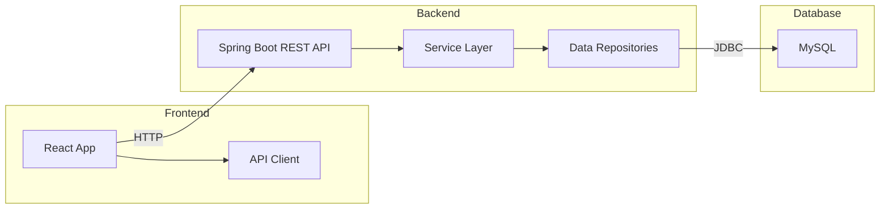
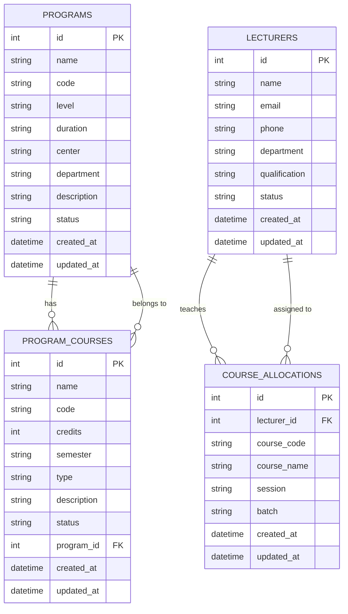
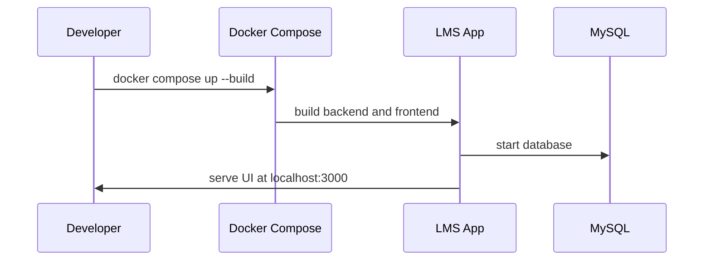

# LMS Project Presentation for Boss

## 1. Executive Summary

This LMS project is a complete application for managing C-DAC Bangalore programs, courses, and lecturer course allocation.

- Built with **React** frontend and **Spring Boot** backend.
- Uses **MySQL** as the production database.
- Deployed with **Docker Compose** for fast local startup.
- Designed for C-DAC Bangalore academic and training workflows.

---

## 2. Why this project matters

This system helps C-DAC Bangalore by:

- Managing programs and course structures centrally.
- Assigning lecturers to courses and batches.
- Enabling faster academic planning and course tracking.
- Reducing manual Excel / paper work.

---

## 3. Key features

- Program creation and editing
- Course management inside programs
- Course allocation to lecturers
- Dashboard-style navigation
- MySQL-backed persistence for stable data
- Docker-based deployment for repeatable setup

---

## 4. Architecture diagram

---

## 4.1 Entity Relationship Diagram (ER)

---

## 5. Demo flow (what to show)

1. Open the app at `http://localhost:3000`.
2. Show the **Programs** section.
3. Add or edit a program.
4. Show the **Course Allocation** page.
5. Assign a lecturer to a course and batch.
6. Confirm data is saved in MySQL and shown in the list.

---

## 6. Technology stack

- **Frontend**: React, Vite, Bootstrap, Axios
- **Backend**: Spring Boot, Spring Data JPA
- **Database**: MySQL
- **Deployment**: Docker, Docker Compose

---

## 7. Deployment overview

---

## 8. Why this is good for C-DAC Bangalore

- **Faster rollout**: Docker Compose means the system starts in minutes.
- **Reliable data**: MySQL ensures consistent storage.
- **Local development**: developers can update features quickly.
- **C-DAC tailored**: the system supports program levels and batch allocations that match C-DAC use cases.

---

## 9. Presentation animations

For presentation, use the following ideas:

- Animate the architecture diagram while explaining frontend → backend → database.
- Show a live app walkthrough with a screen-recording GIF.
- Use simple slide transitions to highlight each section.

> Note: This markdown file includes Mermaid diagrams that render in many Markdown viewers. For a live presentation, you can convert these diagrams into animated slides or GIFs.

---

## 10. Next steps

- Add lecturer and student management.
- Add role-based access control.
- Add analytics dashboards for course utilization.
- Add a mobile-friendly responsive UI.

---

## 11. Contact

For any questions, I am ready to explain the architecture, deployment, and next improvements.
