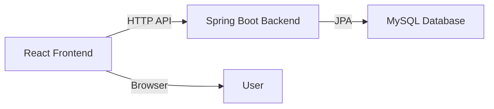

# LMS Project - Guide

## 1. What is this project?

This project is a learning management system (LMS) customized for C-DAC Bangalore, India. It has:

- A **Spring Boot backend** for data storage and API services.
- A **React frontend** for the admin dashboard and course allocation workflows.
- A **MySQL database** configured via Docker Compose.
- A **Docker-based setup** to start the backend, frontend, and database together.

The system supports programs, courses, and lecturer course allocations.

---

## 2. What is inside the project?

### Backend

Located in `src/main/java/com/lms`.

- `controller/` - REST API endpoints.
- `service/` - Business logic and validations.
- `repository/` - Spring Data JPA repositories for database access.
- `entity/` - Database entities for programs, courses, lecturers, and allocations.
- `dto/` - Request and response objects used by the API.
- `exception/` - Error handling and exception responses.
- `config/` - Spring configuration and CORS setup.

Important files:

- `LmsProApplication.java` - entry point for the Spring Boot app.
- `application.properties` - datasource and JPA configuration.
- `pom.xml` - project dependencies including MySQL, Spring Boot, and JPA.

### Frontend

Located in `frontend/src`.

- `pages/` - UI pages for programs, courses, and allocations.
- `layouts/` - Dashboard layout and navigation.
- `components/` - reusable components such as sidebar and toast messages.
- `services/api.js` - centralized API client and endpoint definitions.
- `routes/App.jsx` - frontend route configuration.

Important files:

- `frontend/package.json` - frontend dependencies and scripts.
- `frontend/Dockerfile` - frontend container build.

### Docker

- `docker-compose.yml` - starts MySQL, backend, and frontend together.
- `Dockerfile` - builds the Java backend image.

---

## 3. Quick start

### Prerequisites

Before you start, install:

- Java 17
- Maven
- Node.js and npm
- Docker and Docker Compose

### Step 1: Clone the repository

```bash
git clone https://github.com/Vedprtpsingh/lmsproject.git
cd lmsproject
```

### Step 2: Install frontend dependencies

```bash
cd frontend
npm install
cd ..
```

### Step 3: Start the full stack with Docker

```bash
docker compose up --build
```

This command will:

- start a MySQL database at `mysql:3306`
- start the Spring Boot backend at `http://localhost:8080`
- start the React frontend at `http://localhost:3000`

### Step 4: Open the app

Visit:

- Frontend: `http://localhost:3000`
- Backend API: `http://localhost:8080/api`

If you only want the backend, use:

```bash
cd /workspaces/lmsproject
mvn spring-boot:run
```

If you only want the frontend, use:

```bash
cd frontend
npm run dev
```

---

## 4. How the app works

### User flow

1. User opens the frontend dashboard.
2. The frontend calls backend APIs via `frontend/src/services/api.js`.
3. Backend controllers receive requests and forward them to services.
4. Services use repositories to store and fetch data from MySQL.
5. Results are returned to the frontend and displayed in the UI.

### Key frontend pages

- **Course Allocation**: view existing allocations and assign courses to lecturers.
- **Programs List**: browse and manage academic programs.
- **Add Program**: create or update a program.
- **Program Courses**: manage courses inside a program.
- **Add Course**: add new courses to a program.

### Key backend APIs

- `GET /api/programs` - list programs
- `POST /api/programs` - create a new program
- `PUT /api/programs/{id}` - update a program
- `DELETE /api/programs/{id}` - remove a program
- `GET /api/course-allocations` - list allocations
- `POST /api/course-allocations` - create a course allocation
- `DELETE /api/course-allocations/{id}` - delete an allocation

---

## 5. Deep architecture overview

### Architecture diagram



### Backend structure

- `controller/` receives HTTP requests.
- `service/` contains the app logic.
- `repository/` communicates with MySQL.
- `entity/` defines tables and relationships.
- `dto/` shapes input and output data.

### Frontend structure

- `routes/App.jsx` defines navigation routes.
- `layouts/DashboardLayout.jsx` contains the sidebar and header.
- `services/api.js` centralizes network requests.
- `pages/` render UI screens and forms.

### Database configuration

Configured in `src/main/resources/application.properties`:

- `spring.datasource.url` points to MySQL
- `spring.datasource.username` and `spring.datasource.password`
- `spring.jpa.hibernate.ddl-auto=update`

### Docker setup

`docker-compose.yml` starts:

- `mysql` service
- `backend` service
- `frontend` service

The backend service depends on `mysql` and uses the MySQL URL from environment variables.

---

## 6. Running and testing

### Rebuild after code changes

```bash
docker compose up --build
```

or rebuild backend only:

```bash
docker compose build backend
```

### View logs

```bash
docker compose logs -f backend
```

### Common issues

- If the backend cannot connect to MySQL, restart the compose services.
- If the frontend cannot load, check `frontend/.env` or `frontend/package.json` scripts.
- If MySQL data is missing, ensure volume `mysql-data` is mounted correctly.

---

## 7. C-DAC Bangalore project details

This implementation is tailored for C-DAC Bangalore and supports:

- C-DAC program levels
- Batch-based course allocation
- Center and department support
- Course type values for lab and project work

If you want, I can also add a separate developer quickstart with commands for Windows and Linux.
